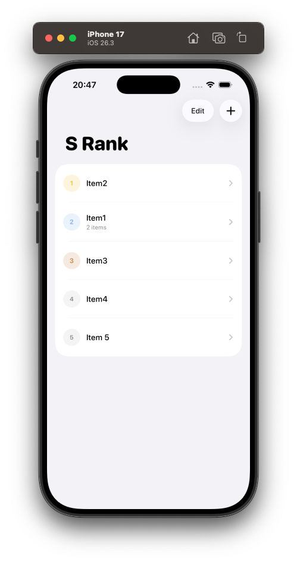
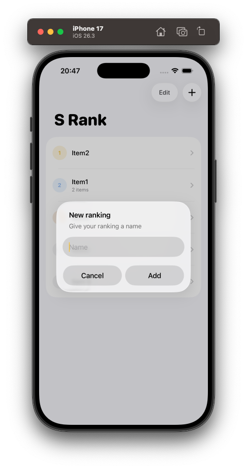

# S Rank

A clean iOS app for building and managing ranked lists built in Swift. Create rankings for anything — games, movies, restaurants — and organize items into nested folders.

## Screenshots

  
  

## Features

- Create and name custom ranked lists
- Nested folder support for organizing items
- Drag to reorder rankings
- Color-coded rank indicators
